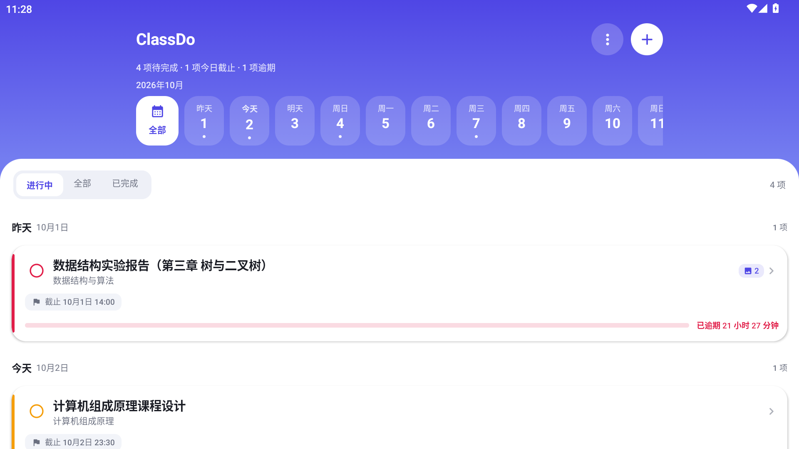
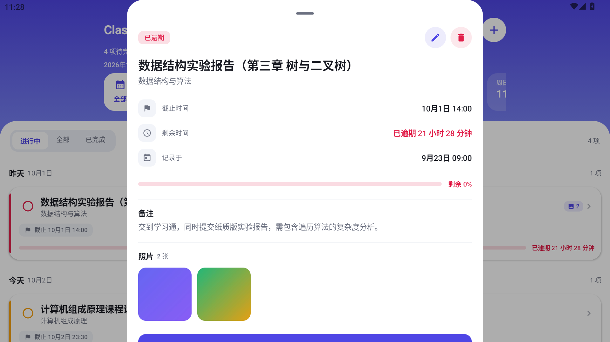
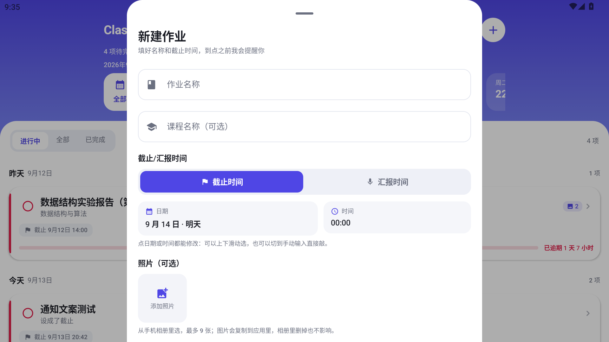
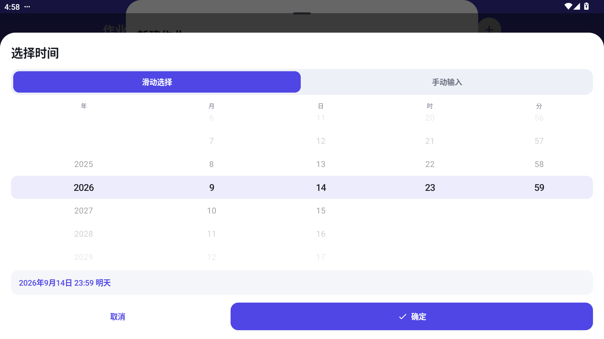
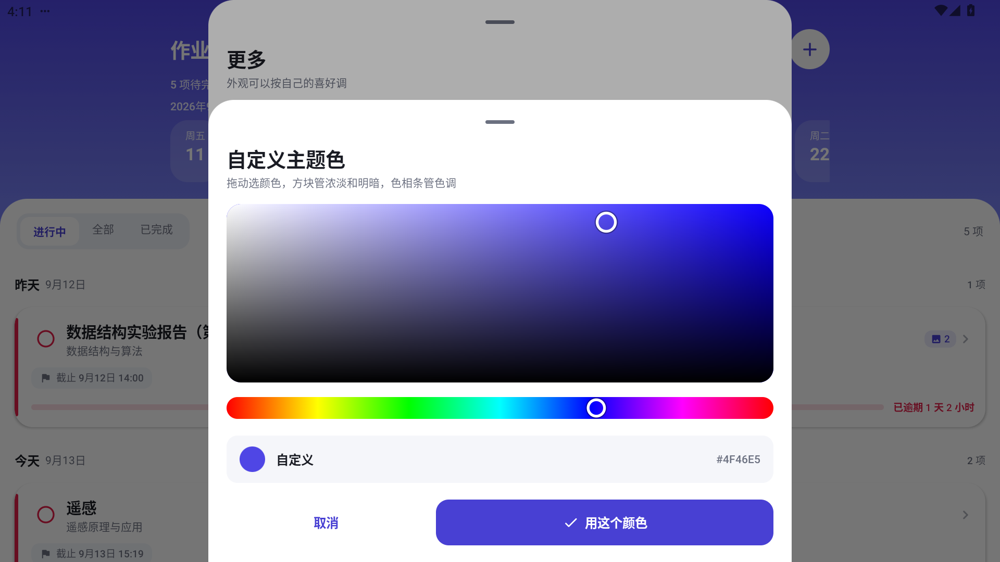
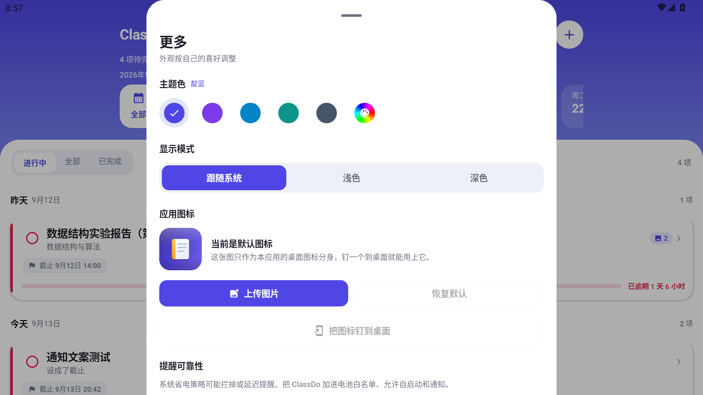

<div align="center">

# ClassDo · 课程作业管家

**记录课程作业与截止 / 汇报时间，到点前提醒你，别错过任何一次任务。**


</div>

---

## 它是什么

一个**纯本地**的安卓小应用，专门用来记大学课程作业：每条作业记下 **名称 / 课程 / 截止或汇报时间 / 备注 / 照片**，并在到点前分三次提醒你。

数据只存在自己手机里，**不联网、不要账号、没有任何第三方 SDK**。

## 截图

| 主页 | 详情 |
| :---: | :---: |
|  |  |

| 新建 / 编辑作业 | 时间选择器 |
| :---: | :---: |
|  |  |

| 调色盘 | 更多设置 |
| :---: | :---: |
|  |  |

## 功能

### 记录与查看

- 顶部一条**可左右滑动的日期条**（过去的只留到昨天，往后 60 天），有作业的日期下面有小圆点，颜色代表紧急程度
- 下面的**条状卡片**是每条作业的简介：名称、课程、截止/汇报时间、时间进度条、还剩多久
- **点卡片进详情**：完整内容 + 备注 + 照片，右上角是铅笔（编辑）和垃圾桶（删除）
- 列表可按 **进行中 / 全部 / 已完成** 筛选；看「全部」时按日期分组，带「今天 / 明天 / 周三」这种自然语言标题
- 卡片左侧勾一下即标记完成，它的提醒会自动撤销

### 时间与提醒

- **截止 / 汇报二选一**：每条作业自己选这个时间属于哪种，卡片图标、详情字段名、提醒文案全都跟着变
- 三次本地提醒：**提前 1 天 / 提前 1 小时 / 到点**；只排还没到的那些时间点，不会把过去的时间点补响
- 点通知直接跳到对应那条作业的详情
- 手机重启 / 应用更新后自动重排闹钟

### 界面

- **主题色**：5 个预设 + 一个调色盘（饱和度×明度方块 + 色相条），可以选任意颜色
- **显示模式**：跟随系统 / 浅色 / 深色
- 整套配色只由一个主色种子推导（容器色、暗色变体、顶部渐变都是算出来的）；挑到很亮的颜色时前景色会自动翻成深色，保证看得清
- **自定义图标**：上传图片 → 裁剪成 1:1 → 钉一个快捷方式到桌面
- 自带一个手绘的**作业本图标**（纯矢量，任意分辨率都清晰）

### 输入体验

- **时间选择器**：年月日时分五列滚轮（带吸附惯性），或切到手动输入直接敲数字；年份可选到 2099；面板从底部滑上来，顶部的「小白条 + 标题」按住往下拖会跟着手指走，拖够远就滑出去关掉，没拖够弹回原位
- **草稿自动保存**：新建和编辑作业都是填一半退出不会丢，5 分钟内回来还在，超时自动作废（连它带进来的照片一起清）；草稿按作业分开记，新建的草稿不会串进某条作业的编辑表单
- **照片**：从系统相册选，最多 9 张，复制进应用私有目录（之后在相册里删掉原图也不影响）；支持全屏查看：双指缩放 / 双击缩放 / 拖动
- 时间填成过去的会自动提示「保存后会直接显示为逾期」

## 下载安装

到 [Releases](../../releases) 下载最新 APK 直接安装（需要 Android 8.0 及以上）。

> 首次安装系统可能提示「未知来源应用」，允许即可。

## 自己编译

需要 **JDK 17** 和 **Android SDK**（platform 34 + build-tools 34）。

```bash
git clone <仓库地址>
cd ClassDo
./gradlew assembleDebug        # Windows 用 gradlew.bat
```

产物在 `app/build/outputs/apk/debug/app-debug.apk`。也可以用 Android Studio 直接 Open 这个目录。

**关于 release 签名**：仓库里**没有**任何签名文件（`keystore.properties` 和 `*.jks` 都在 `.gitignore` 里）。自己打正式包时，在项目根目录建一个 `keystore.properties`：

```properties
storeFile=app/keystore/你的.jks
storePassword=******
keyAlias=******
keyPassword=******
```

没有这个文件时，`assembleRelease` 会打成未签名包，`assembleDebug` 不受影响。

## 技术栈

| | |
| --- | --- |
| 语言 | Kotlin 2.0 |
| 界面 | Jetpack Compose + Material 3 |
| 构建 | AGP 8.5 / Gradle 8.7 / JDK 17 |
| 版本 | Android 8.0+（minSdk 26），target 34 |
| 持久化 | 作业数据用 kotlinx.serialization 写进私有目录的 JSON；外观设置在 SharedPreferences |
| 提醒 | AlarmManager + BroadcastReceiver + NotificationCompat |
| 依赖 | 只有 AndroidX / Compose / kotlinx.serialization，没有任何第三方 SDK |

## 项目结构

```
app/src/main/java/com/coursework/tracker/
├── MainActivity.kt              入口，edge-to-edge + 通知权限
├── HomeworkApp.kt               Application，建通知渠道 + 清理过期草稿
├── model/Assignment.kt          数据模型（含进度条公式）
├── data/
│   ├── AssignmentRepository.kt  JSON 读写
│   ├── DraftStore.kt            新建 / 编辑作业的草稿（5 分钟有效期，按作业 id 区分）
│   ├── PhotoStore.kt            照片复制、删除、降采样解码 + 内存缓存
│   ├── IconStore.kt             自定义图标存取
│   └── SettingsStore.kt         主题色 / 显示模式
├── notify/                      闹钟排程、通知构建、开机重排
├── ui/
│   ├── AssignmentViewModel.kt   状态与业务
│   ├── SettingsViewModel.kt     外观设置
│   ├── HomeScreen.kt            主界面
│   └── components/              日期条、卡片、详情、编辑表单、选择器、调色盘……
└── util/TimeFormat.kt           时间格式化
```

## 几个实现细节

- **进度条公式**：`（当前到截止的剩余时间）÷（记录时刻到截止的总时间）`，单位按总跨度分档，跨度越小单位越细——**< 1 小时按秒、< 3 天按分钟、≥ 3 天按小时**。单位只取决于「记录时刻到截止」这段固定跨度，不随时间漂移；改了截止时间，跨度变了，单位自然跟着换一档。
- **提醒文案跟着设置走**：设成「截止」就说「距截止还有…」「现在就到截止时间啦」，设成「汇报」就说汇报，不会前后不一致。
- **照片降采样**：解码时按目标尺寸算 `inSampleSize`，配 `LruCache`（可用内存的 1/8），列表滚动不会反复解码也不会 OOM；读 EXIF 自动把竖拍照片转正。
- **删作业会连照片一起删**，但只删「删完之后没人再引用」的文件，不会误删别的作业在用的图。
- **时间选择器刻意不用 ModalBottomSheet**：底部弹层会把没落在滚轮上的竖向手势拿去拖动整个面板，导致滚轮抢不到手势；改成贴底固定的 Dialog 后竖向手势全部归滚轮。关面板改成自己做：顶部「小白条 + 标题」那一块按住往下拖，拖动期间直接写位移（不经协程、不触发重组），松手后按距离或甩动速度决定滑出还是弹回；面板位移用布局位移而不是图层平移，滚轮和模式切换的触摸才不受影响。遮罩按位移用 `drawBehind` 画，不为透明度单独开离屏层。

## 已知限制

- 提醒依赖系统闹钟。在国产 ROM 上，**划掉最近任务可能把应用强停**，强停会清掉闹钟，而且应用侧无法绕过（这是安卓的设计）。建议在系统设置里给 ClassDo 打开**自启动**、电池策略设为**不限制**，并别用一键清理清它。
- 应用自己的桌面图标由安装包里的资源决定，**第三方应用无法在运行时替换**；「更多 → 应用图标」上传的图只能用于钉一个快捷方式到桌面。
- 数据只在本机，不联网也不同步。

## 致谢

开发过程由 **DeepSeek** 辅助完成。

## License

[MIT](LICENSE) © 2026 咕子曲奇GuZzz
